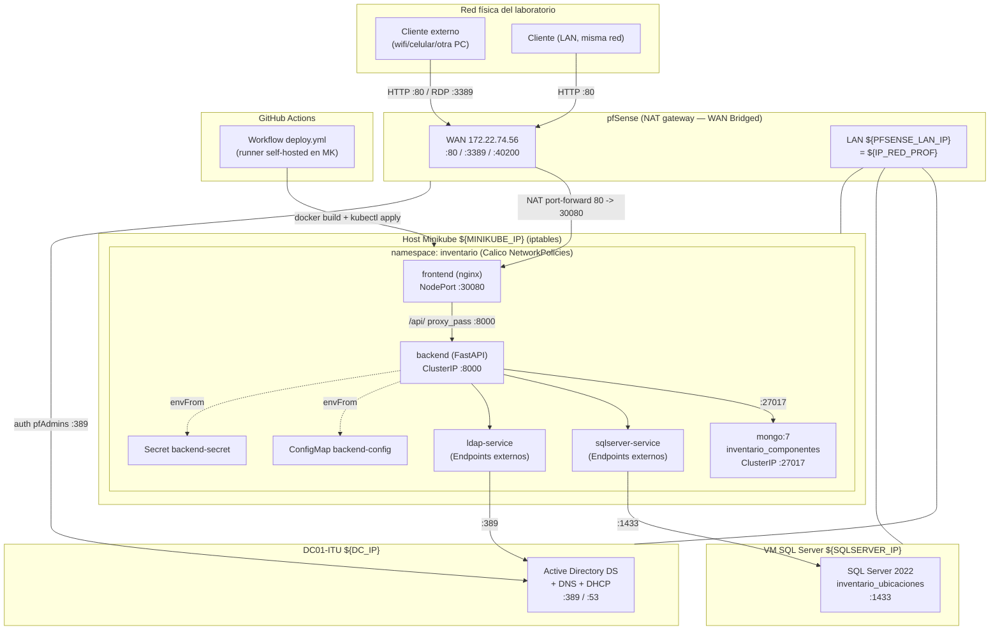

# Arquitectura — Inventario ITU

## Visión general

El Inventario ITU es un sistema de gestión de equipos de laboratorio
compuesto por:

- **Frontend**: HTML/CSS/JS vanilla (Bootstrap 5), servido como
  contenido estático por nginx.
- **Backend**: API REST en FastAPI (Python 3.12), con autenticación
  JWT respaldada por LDAP/Active Directory.
- **Base relacional**: SQL Server 2022 (`inventario_ubicaciones`) —
  ubicaciones, equipos, personas, asignaciones, mantenimientos.
- **Base documental**: MongoDB 7 (`inventario_componentes`, colección
  `computadoras`) — componentes detallados de cada equipo (CPU, RAM,
  almacenamiento, periféricos), enlazados por `id_equipo`.
- **Identidad**: Active Directory (`itu.local`) vía LDAP.
- **Red/perímetro**: pfSense (NAT gateway + auth AD, configurable por
  SSH desde `pfsense/scripts/`) e iptables (host de Minikube). Las IPs
  de la red del laboratorio se resuelven dinámicamente (`infra/`, ver
  `docs/topologia-red.md`).
- **Acceso externo**: pfSense WAN en modo **Bridged** obtiene IP real de
  la red del laboratorio (172.22.74.56). NAT port-forwards exponen el
  frontend (`WAN:80 -> ${MINIKUBE_IP}:30080`), RDP al AD (`WAN:3389`)
  y RDP al SQL Server (`WAN:40200`). No se requiere port-forward VirtualBox.
- **Orquestación**: Kubernetes (Minikube + Calico CNI), namespace
  `inventario`, con NetworkPolicies zero-trust.
- **CI/CD**: GitHub Actions (`workflow_dispatch`) con runner
  self-hosted en el host de Minikube.

Este repositorio contiene todo el código de la aplicación y la
infraestructura necesaria para desplegar y operar el sistema:
`backend/`, `frontend/`, `bases-de-datos/`, manifiestos de Kubernetes,
scripts de Active Directory, pfSense e iptables.

---

## Diagrama de componentes (Mermaid)

---

## Componentes y responsabilidades

| Componente | Responsable (rol) | Carpeta en el repo |
|---|---|---|
| Frontend (HTML/JS) | Integrante Frontend | `frontend/` |
| Backend (FastAPI) | Integrante Backend | `backend/` |
| Scripts SQL Server / MongoDB | Integrante Bases de Datos | `bases-de-datos/` |
| Kubernetes, NetworkPolicies, pfSense, AD, firewall SQL Server, iptables, CI/CD | Integrante Seguridad y Redes | `kubernetes/`, `active-directory/`, `pfsense/`, `sql-server-iis/`, `iptables/`, `.github/` |

---

## Flujo de autenticación (alto nivel)

1. El usuario abre `index.html` (servido por `frontend`/nginx) e
   ingresa usuario/contraseña institucionales.
2. El frontend llama a `POST /auth/login` (vía proxy `/api/` →
   `backend-service:8000`).
3. `app/services/auth_service.py` delega en
   `app/services/ldap_service.py`:
   - `autenticar()` hace **bind** contra AD con
     `LDAP_USER_DN_TEMPLATE = {username}@itu.local`.
   - `obtener_rol()` determina si el usuario pertenece a
     `Tecnicos`, `Docentes` o `Alumnos` (requiere el bind de servicio
     `svc-inventario`, ver `active-directory/README.md` sección 4).
4. Si las credenciales son válidas, el backend emite un JWT
   (`python-jose`, HS256, 60 min) que el frontend guarda en
   `localStorage` y reenvía en cada request (`Authorization: Bearer`).
5. Los endpoints de escritura (`POST/PUT/DELETE /inventario/...`)
   exigen rol `Tecnicos` vía la dependencia `requiere_tecnico`
   (`app/dependencies.py`).

---

## Flujo de datos del inventario

- `GET /inventario/` y `GET /inventario/{id}` combinan datos de
  **SQL Server** (`Equipo`, `Ubicacion`, `Persona`, `Asignacion`,
  `Mantenimiento`) y **MongoDB** (`computadoras`), enlazados por el
  campo puente `id_equipo`.
- Las altas de equipos crean primero el registro en SQL Server
  (`Equipo`) y luego el documento de componentes en MongoDB con el
  mismo `id_equipo`.

---

## Seguridad: defensa en profundidad

Ver el detalle completo en `docs/topologia-red.md` y `iptables/README.md`.
Resumen de las 3 capas:

1. **pfSense** (borde de red): NAT, port-forward del frontend (80 →
   NodePort 30080) como vía de acceso externo, autenticación de
   administradores contra AD. Configurable como código vía SSH + `php -f`
   (`pfsense/scripts/`, ver `pfsense/README.md`).
2. **Calico NetworkPolicies** (dentro del clúster): modelo
   default-deny, 7 políticas (00-06) que permiten solo los flujos
   estrictamente necesarios entre frontend/backend/mongo/SQL/AD.
3. **iptables** (host de Minikube): filtra el tráfico dirigido al
   nodo (SSH, ICMP, NodePort), sin interferir con las cadenas que
   gestiona Calico.

**Acceso externo**: pfSense WAN en modo Bridged tiene IP real de la red
física (`172.22.74.56`). NAT port-forwards activos: `WAN:80 → ${MINIKUBE_IP}:30080`
(app web), `WAN:3389 → ${DC_IP}:3389` (RDP al AD), `WAN:40200 → ${SQLSERVER_IP}:3389`
(RDP al SQL). El tráfico al frontend sigue gobernado por `02-allow-frontend-ingress`;
el modelo zero-trust dentro del clúster no cambia.

Además: credenciales nunca en el repo (Secrets de Kubernetes +
GitHub Secrets), JWT con expiración corta (60 min), RBAC por rol de
AD (`Tecnicos`/`Docentes`/`Alumnos`).
