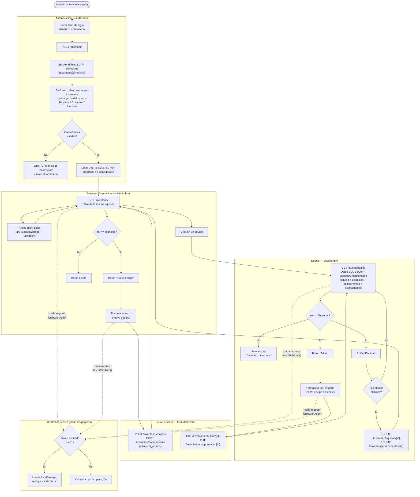

# Flujo de la aplicación web

## Diagrama de navegación y flujo de datos

---

## Roles y permisos

| Rol | Login | Ver listado | Ver detalle | Crear equipo | Editar equipo | Eliminar equipo |
|---|---|---|---|---|---|---|
| `Tecnicos` | ✅ | ✅ | ✅ | ✅ | ✅ | ✅ |
| `Docentes` | ✅ | ✅ | ✅ | ❌ | ❌ | ❌ |
| `Alumnos` | ✅ | ✅ | ✅ | ❌ | ❌ | ❌ |

Los roles se leen del JWT (`rol` claim). Los botones de escritura se ocultan
en el frontend si el rol no es `Tecnicos`. Los endpoints de escritura
(`POST/PUT/DELETE`) validan el rol también en el backend (`requiere_tecnico`
en `app/dependencies.py`), de modo que la restricción existe en las dos capas.

---

## Flujo de datos por operación

| Operación | Frontend | Backend | SQL Server | MongoDB |
|---|---|---|---|---|
| Login | `POST /auth/login` | bind LDAP → AD | — | — |
| Ver listado | `GET /inventario/` | `equipo_repo` + `computadora_repo` | `Equipo` + `Ubicacion` | `computadoras` (todos) |
| Ver detalle | `GET /inventario/{id}` | `inventario_service` | `Equipo` + `Ubicacion` + `Persona` + `Asignacion` + `Mantenimiento` | `computadoras` (por `id_equipo`) |
| Crear equipo | `POST /equipos` + `POST /componentes` | dos repos coordinados | INSERT en `Equipo` | insertOne en `computadoras` |
| Editar equipo | `PUT /equipos/{id}` + `PUT /componentes/{id}` | dos repos coordinados | UPDATE en `Equipo` | updateOne en `computadoras` |
| Eliminar equipo | `DELETE /equipos/{id}` | coordina ambas eliminaciones | DELETE en `Equipo` (cascade a `Asignacion`/`Mantenimiento`) | deleteOne en `computadoras` |
